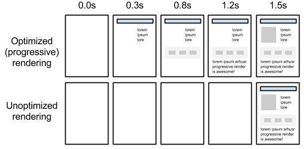
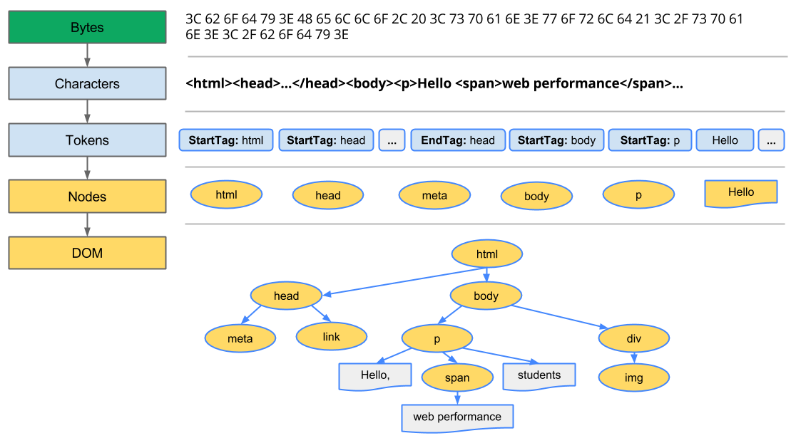
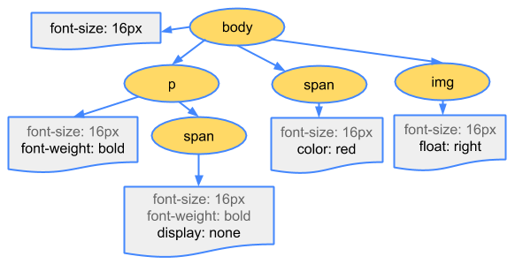
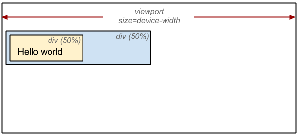

#Web Optimizing Performance

##Critical Rendering Path

Optimizing the critical rendering path is critical for improving performance of the pages: The developer goal is to prioritize and display the content that relates to the primary action of the user wants to take on a page.

Delivering a fast web experience requires a lot of work by the browser. Most of this work is hidden from the web developers: how the browser rendering the HTML, CSS, Javascript on the screen.

Optimizing for performance is about understanding all the happens in these intermediate step between receiving the HTML, CSS, and JavaScript bytes and the required processing to turn them into rendered pixels - that is the critical **rendering path**.



By optimizing the critical rendering path we can significantly improve the time to first render of our pages. Further, understanding the critical rendering path will also serve as a foundation for building well performing interactive applications.
First, let’s take a quick, ground-up overview of how the browser goes about displaying a simple page.

###Constructing the Object Model

Before the browser can render the page it needs to construct the DOM and CSSOM trees. As a result, HTML and CSS need to be delivered to the browser as quickly as possible.

**TL;DR**
- Bytes -> characters -> tokens -> nodes -> object model,

- HTML markup is transformed into a Document Object Model (DOM), CSS markup is transformed into a CSS Object Model (CSSOM),

- DOM and CSSOM are independent data structures,

- Chrome DevTools Timeline allows us to capture and inspect the construction and processing costs of DOM and CSSOM.

####Document Object Model (DOM)

```html
<html>
  <head>
    <meta name="viewport" content="width=device-width,initial-scale=1.0">
    <link href="style.css" rel="stylesheet">
    <title>Critical Path</title>
  </head>
  <body>
    <p>Hello <span>web performance</span> students!</p>
    <div></div>
  </body>
</html>
```

To see how the browser process the rendering page, we consider the simplest case: a plain HTML page with some text and a single image



1. **Conversion:** the browser reads the raw bytes of the HTML off the disk or network and translates them to individual characters based on specified encoding of the file (e.g. UTF-8).

2. **Tokenizing:** the browser converts strings of characters into distinct tokens specified by the W3C HTML5 standard - e.g. `<html>`, `<body>` and other strings within the "angle brackets". Each token has a special meaning and a set of rules.

3. **Lexing:** the emitted tokens are converted into "objects" which define their properties and rules.

4. **DOM construction:** Finally, because the HTML markup defines relationships between different tags (some tags are contained within tags) the created objects are linked in a tree data structure that also captures the parent-child relationships defined in the original markup: HTML object is a parent of the body object, the body is a parent of the paragraph object, and so on.


**The final output of this entire process is the Document Object Model, or the "DOM" of a page, which the browser uses for all further processing of the page.**

Every time the browser has to process HTML markup it has to step through all of the steps above: convert bytes to characters, identify tokens, convert tokens to nodes, and build the DOM tree. This entire process can take some time, especially if we have a large amount of HTML to process.

The DOM tree captures the properties and relationships of the document markup, but it does not tell anything about how the element should look when rendered. That is the responsibility of the CSSOM.

####CSS Object Model (CSSOM)

In the previous simple page, while the browser was constructing the DOM, it will encountered a link tag in the head section of the document referencing an external CSS stylesheet call: `style.css`. The browser will dispatches a request for this resource, to get the following content:

```css
  body { font-size: 16px }
  p { font-weight: bold }
  span { color: red }
  p span { display: none }
  img { float: right }
```

Just as with HTML, CSS recieved need to be converted into something that the browser can understand and work with. And the process are very similiar to processing HTML:


The CSS bytes are converted into characters, then to tokens and nodes, and finally are linked into a tree structure known as the “CSS Object Model”, or CSSOM for short:



When computing the final set of styles for any object on the page, the browser starts with the most general rule applicabel to that node (Example: if the object is a child of body element, then all body styles apply) and then recursively refines the computed styles by applying more specific rules - i.e the rules "cascade down"

Consider the CSSOM tree above. Any text contained within the `span` tag placed within the body element will have a font size of 16 pixels and have red text - the `font-size` directive cascade down from body to the span. However, if a span tag is child of a paragraph `p` tag, then the content are not displayed.

The above CSSOM tree is the tree of the styles override in the example `style.css` file. It is not the complete CSSOM tree of the web page. Every browser provides a default set of styles also known as "user agent style". The css style which user create will override these default styles of the "agent".

To see how long the CSS processing took, using tool like Chrome DevTool to record a timeline and look for "Recaculate Style" event.

The CSSOM and the DOM are independent data structure. The browser need the render tree to links the CSSOM and DOM together to render a simple web page.

###Render-tree construction, Layout, and Paint

The CSSOM and DOM trees are combined into a render tree, which is then used to compute the layout of each visible element and serves as an input to the paint process which is the browser renders pixels to screen.

Optimizing each of these steps is critical to achieve optimal rendering performance.

**TL;DR**
- The DOM and CSSOM trees are combined to form the render tree,

- Render tree contains only the nodes required to render the page,

- Layout computes the exact position and size of each object,

- Paint is the last step that takes in the final render tree and renders the pixels to the screen

The first step is for the browser to combine the DOM and CSSOM into a "render tree" that captures all the visible DOM content on the page, plus all the CSSOM style information for each node.


To construct the render tree, the browser roughly does the following:

1. Starting at the root of the DOM tree, traverse each visible node:
  - Some nodes are not visible (eg. script tags, meta tags...), and are ommited because they are not refelct in the rendered output,
  - Some nodes are hidden via CSS (`display: none;`) and are also omitted from the render tree.

2. For each visible node find the appropriate matching CSSOM rules and apply them.

3. Emit visible nodes with content and their computed styles.

**Note**

> `visibility: hidden` is different from `display: none`. The former makes the
> element invisible, but the element is still occupies space in the layout
> (i.e empty box), whereas the later removes the element entirely from the render
> tree.

The final output is a render that contains both the content and the style information of all the visible content on the screen. And with the render tree in place, now the browser are ready for the "layout" stage.

At this point, the browser has know which nodes should be visible and their computed styles, but it have not calculated their exact position and size within the _viewport_ of the device, which is the work from the "layout" stage, also known as "reflow"

To figure out the exact size and position of each object, the browser begins at the root of the render tree and traverses it to compute the geometry of each object on the page. Lets start with a simple example:

```html
    <html>
      <head>
        <meta name="viewport" content="width=device-width,initial-scale=1.0">
        <title>Critial Path: Hello world!</title>
      </head>
      <body>
        <div style="width: 50%">
          <div style="width: 50%">Hello world!</div>
        </div>
      </body>
    </html>
```

In this example, the body contains two nested div: first, the parent div which has the display width is 50% of the viewport width, and the second - child div - has the display width is 25% of the viewport width or 50% of its parent div width.


