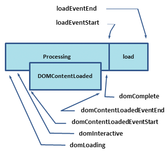

#Web Optimizing Performance

Table of navigation

  - [Critical Rendering Path](#critical-rendering-path)

  - [Constructing the Object Model](#constructing-the-object-model)

  - [Render-tree construction, Layout, and Paint](#render-tree-construction-layout-and-paint)

  - [Rendering block CSS](#rendering-block-css)

  - [Adding interactivity with Javascript](#adding-interactivity-with-javascript)

  - [Measuring the Critical Rendering Path (Page Load Speed) with Navigation Timing](##measuring-the-critical-rendering-path-page-load-speed-with-navigation-timing)

  - [Analyzing Critical Rendering Path Performance](#analyzing-critical-rendering-path-performance)

  - [Optimizing the Critical Rendering Path](#optimizing-the-critical-rendering-path)

  - [PageSpeed Rules](#pagespeed-rules)

##Critical Rendering Path

Optimizing the critical rendering path is critical for improving performance of the pages: The developer goal is to prioritize and display the content that relates to the primary action of the user wants to take on a page.

Delivering a fast web experience requires a lot of work by the browser. Most of this work is hidden from the web developers: how the browser rendering the HTML, CSS, Javascript on the screen.

Optimizing for performance is about understanding all the happens in these intermediate step between receiving the HTML, CSS, and JavaScript bytes and the required processing to turn them into rendered pixels - that is the critical **rendering path**.


By optimizing the critical rendering path we can significantly improve the time to first render of our pages. Further, understanding the critical rendering path will also serve as a foundation for building well performing interactive applications.
First, let’s take a quick, ground-up overview of how the browser goes about displaying a simple page.

###Constructing the Object Model

Before the browser can render the page it needs to construct the DOM and CSSOM trees. As a result, HTML and CSS need to be delivered to the browser as quickly as possible.

**TL;DR**

- Bytes -> characters -> tokens -> nodes -> object model,

- HTML markup is transformed into a Document Object Model (DOM), CSS markup is transformed into a CSS Object Model (CSSOM),

- DOM and CSSOM are independent data structures,

- Chrome DevTools Timeline allows us to capture and inspect the construction and processing costs of DOM and CSSOM.

####Document Object Model (DOM)

```html
<html>
  <head>
    <meta name="viewport" content="width=device-width,initial-scale=1.0">
    <link href="style.css" rel="stylesheet">
    <title>Critical Path</title>
  </head>
  <body>
    <p>Hello <span>web performance</span> students!</p>
    <div></div>
  </body>
</html>
```

To see how the browser process the rendering page, we consider the simplest case: a plain HTML page with some text and a single image


1. **Conversion:** the browser reads the raw bytes of the HTML off the disk or network and translates them to individual characters based on specified encoding of the file (e.g. UTF-8).

2. **Tokenizing:** the browser converts strings of characters into distinct tokens specified by the W3C HTML5 standard - e.g. `<html>`, `<body>` and other strings within the "angle brackets". Each token has a special meaning and a set of rules.

3. **Lexing:** the emitted tokens are converted into "objects" which define their properties and rules.

4. **DOM construction:** Finally, because the HTML markup defines relationships between different tags (some tags are contained within tags) the created objects are linked in a tree data structure that also captures the parent-child relationships defined in the original markup: HTML object is a parent of the body object, the body is a parent of the paragraph object, and so on.


**The final output of this entire process is the Document Object Model, or the "DOM" of a page, which the browser uses for all further processing of the page.**

Every time the browser has to process HTML markup it has to step through all of the steps above: convert bytes to characters, identify tokens, convert tokens to nodes, and build the DOM tree. This entire process can take some time, especially if we have a large amount of HTML to process.

The DOM tree captures the properties and relationships of the document markup, but it does not tell anything about how the element should look when rendered. That is the responsibility of the CSSOM.

####CSS Object Model (CSSOM)

In the previous simple page, while the browser was constructing the DOM, it will encountered a link tag in the head section of the document referencing an external CSS stylesheet call: `style.css`. The browser will dispatches a request for this resource, to get the following content:

```css
  body { font-size: 16px }
  p { font-weight: bold }
  span { color: red }
  p span { display: none }
  img { float: right }
```

Just as with HTML, CSS recieved need to be converted into something that the browser can understand and work with. And the process are very similiar to processing HTML:


The CSS bytes are converted into characters, then to tokens and nodes, and finally are linked into a tree structure known as the “CSS Object Model”, or CSSOM for short:


When computing the final set of styles for any object on the page, the browser starts with the most general rule applicabel to that node (Example: if the object is a child of body element, then all body styles apply) and then recursively refines the computed styles by applying more specific rules - i.e the rules "cascade down"

Consider the CSSOM tree above. Any text contained within the `span` tag placed within the body element will have a font size of 16 pixels and have red text - the `font-size` directive cascade down from body to the span. However, if a span tag is child of a paragraph `p` tag, then the content are not displayed.

The above CSSOM tree is the tree of the styles override in the example `style.css` file. It is not the complete CSSOM tree of the web page. Every browser provides a default set of styles also known as "user agent style". The css style which user create will override these default styles of the "agent".

To see how long the CSS processing took, using tool like Chrome DevTool to record a timeline and look for "Recaculate Style" event.

The CSSOM and the DOM are independent data structure. The browser need the render tree to links the CSSOM and DOM together to render a simple web page.

[source](https://developers.google.com/web/fundamentals/performance/critical-rendering-path/constructing-the-object-model.html)

###Render-tree construction, Layout, and Paint

The CSSOM and DOM trees are combined into a render tree, which is then used to compute the layout of each visible element and serves as an input to the paint process which is the browser renders pixels to screen.

Optimizing each of these steps is critical to achieve optimal rendering performance.

**TL;DR**
- The DOM and CSSOM trees are combined to form the render tree,

- Render tree contains only the nodes required to render the page,

- Layout computes the exact position and size of each object,

- Paint is the last step that takes in the final render tree and renders the pixels to the screen

The first step is for the browser to combine the DOM and CSSOM into a "render tree" that captures all the visible DOM content on the page, plus all the CSSOM style information for each node.


To construct the render tree, the browser roughly does the following:

1. Starting at the root of the DOM tree, traverse each visible node:
  - Some nodes are not visible (eg. script tags, meta tags...), and are ommited because they are not refelct in the rendered output,
  - Some nodes are hidden via CSS (`display: none;`) and are also omitted from the render tree.

2. For each visible node find the appropriate matching CSSOM rules and apply them.

3. Emit visible nodes with content and their computed styles.

**Note**

> `visibility: hidden` is different from `display: none`. The former makes the
> element invisible, but the element is still occupies space in the layout
> (i.e empty box), whereas the later removes the element entirely from the render
> tree.

The final output is a render that contains both the content and the style information of all the visible content on the screen. And with the render tree in place, now the browser are ready for the "layout" stage.

At this point, the browser has know which nodes should be visible and their computed styles, but it have not calculated their exact position and size within the _viewport_ of the device, which is the work from the "layout" stage, also known as "reflow"

To figure out the exact size and position of each object, the browser begins at the root of the render tree and traverses it to compute the geometry of each object on the page. Lets start with a simple example:

```html
    <html>
      <head>
        <meta name="viewport" content="width=device-width,initial-scale=1.0">
        <title>Critial Path: Hello world!</title>
      </head>
      <body>
        <div style="width: 50%">
          <div style="width: 50%">Hello world!</div>
        </div>
      </body>
    </html>
```

In this example, the body contains two nested div: first, the parent div which has the display width is 50% of the viewport width, and the second - child div - has the display width is 25% of the viewport width or 50% of its parent div width.


The output of the layout process is a "box model" which precisely captures the exact position and size of each element within the viewport; all of the relative measure (e.g 50%) are converted to absolute pixels positions on the screen.

Finally, now the browser know every thing about nodes attributes: visibility, computed styles and geometry. The browser then can process the final stage which will convert each node in the render tree with these information to actual pixels on the screen - this step is often referred to as "painting" or "rasterizing".


The time required to perform render tree construction, layout and paint will vary based on the size of the document, the applied styles, and of course, the device it is running on: the larger the document the more work the browser will have to do; the more complicated the styles are the more time will be consumed for painting also.

Once all is done, the page is finally visible inthe viewport.

**Recap**:

1. Process HTML markup and build the DOM tree,

2. Process CSS markup and build the CSSOM tree,

3. Combine the DOM and CSSOM into a render tree,

4. Run layout on the render tree to compute geometry of each node,

5. Paint the individual nodes to the screen.

If the DOM and CSSOM is modified (e.g by javascript), the browser would have to repeat the same process over again to figure out which pixels need to be re-rendered on the screen.

**Optimizing the critical rendering path is the process of minimizing the total amount of time spent in steps 1 through 5 in the above sequence**. Doing so enables us to render content to the screen as soon as possible and also to reduces the amount of time between screen updates after the initial render - i.e. achieve higher refresh rate for interactive content.

[source](https://developers.google.com/web/fundamentals/performance/critical-rendering-path/render-tree-construction.html)

###Rendering block CSS

Render blocking resource is when the browser hold any other rendering process for the rendering process of the current resource. CSS is treated as one of a render blocking resource which mean the others rendering process might continue if the CSSDOM is constructed. So to improve performance, make sure to keep the CSS lean, deliver it as quickly as possible along with using `media types` and `media queries` to unblock rendering.

**TL;DR**

- CSS is treated as a render blocking resource by default.

- `Media types`, and `media queries` allow to _mark_ some _CSS resource_ as _non render blocking_

- All CSS resource (block or non block) are downloaded by the browser.

Because CSS and HTML are render blocking resources, the browser will block rendering until it retrive both the DOM and CSSOM. That explain when the network is slow and a webpage is load there is a blank page with reloading icon in the title.

Nowadays, there are a lot of devices with different screen size, or maybe the webpage os used to print, and the style for each of those are different. We need a mechanism for loading each of the CSS for each of the devices, instead of loading it altogether at once.

CSS `media types` and `media queries` can be used to separate the rendering CSS for each specific devices.

```css
<link href="style.css" rel="stylesheet">
<link href="print.css" rel="stylesheet" media="print">
<link href="other.css" rel="stylesheet" media="(min-width: 40em)">
```

A media query consists of a media type (like "print") and 0 or more expression for represent conditions of s particular devices.

Example: the first stylesheet declaration does not provide any media type or query -> it applied in all case. Which mean it always render blocking. The second one will only apply when the content is being printed, hence this stylesheet does not block the rendering of the page when it is first loaded. The third stylesheet provides a `media query` which is executed by the browser: if the projection device has match the condition (has width > 40em), the browser of the device will block rendering until the stylesheet is downloaded and processed, else is does not block rendered.

Media query can be used on many characteristics of the device like: display vs. print, screen orientation changes, resize event...

When declaring stylesheet assets, pay close attention to the media type and queries, as they will have big performance impact on the critical rendering path!

Other example:

```css
<link href="style.css"    rel="stylesheet" media="screen">
<link href="portrait.css" rel="stylesheet" media="orientation:portrait">
```

- The first declaration is render blocking and its the same with the declaration without media query because "screen" is the default type if the media is not specify.

- The second declaration has a dynamic media query which will be evaluated when the page is being loaded. Depending on the orientation of the device when the page is loaded, so it may (when the device in portrait mode) or may not (when the devce in other mode) be render blocking.

Because render blocking only refers to whether the browser will have to hold the initial rendering of the page on theresource, it is not about whether the resource is being downloaded or not. In both case, the CSS assets is still downloaded by the browser, but only those which match media query condition will be render blocking.

[source](https://developers.google.com/web/fundamentals/performance/critical-rendering-path/render-blocking-css.html)

###Adding interactivity with Javascript

Javascript can be used to modify just about every aspect of the page: content, style, and user interactions behavior. Howerver, JavaScript can also block DOM construction and delay when the page is rendered. To optimize performance, make the Javascript async and eliminate any unnecessary Javascript from the critical rendering path.

**TL;DR**

- Javascript can query and modify DOM and CSSOM.

- Javascript execution blocks on CSSOM

- Javascript blocks DOM construction unless explicitly declared as async.

First, executing inline javascript will block the DOM construction, which also delay the initial render of the DOM. Because of this, inline javascript is often put at the end of any html files. If it is being put before other element, the DOM of these element can not be construct before the inline script so the script can not be used on these element.

Javascript can read and modify not only the DOM but also the CSSOM. And that lead to a race condition when the browser has not finished downloading and building the CSSOM when the script want to be ran. The browser will delay script execution until int finalize the downloading and constructing the CSSOM, that lead to the DOM construction is also blocked!.

Javascript introduces a lot of new dependencies between the DOM, and CSSOM and the script execution that can lead to significant delays in the rendering process of the page.

1. The location of the script in the document is significant,

2. DOM construction is block when encountered a script tag and until it has finished executing.

3. Javascript can read and modify both DOM and CSSOM.

4. When modify CSSOM, Javascript execution is delayed until the CSSOM is rendered.

####Parser blocking vs Asynchronous

Javascript execution is "parser blocking" by default, which mean when the browser encounters a script tag in the document it must pause the DOM construction, hand over the control to the JS runtime to execute javascript before continue with the DOM construction.

Inline script are always parser blocking unless there are some additional code to defer their execution.

Script included via script tag like:

```javascript
<script src="app.js"></script>
```

is just the same with inline script. The browser still have to pause and execute the script before process the remaining element of the document. However, in this case the browser will have to pause and wait for the script to be downloaded from the server which take much more time to perform than a normal inline script.

Although by default, all Javascript is parser blocking and the browser dose not know what the JS planning to do on the page. But the browser has provide a mechanism to whether execute the script immediately after encounter or wait until the script is ready.

To do this, add `async` mark to the script:

```javascript
<script src="app.js" async></script>
```

Adding the async keyword to the script tag tells the browser that it should not block the DOM construction while it waits for the script to become available.

[source](https://developers.google.com/web/fundamentals/performance/critical-rendering-path/adding-interactivity-with-javascript.html)

###Measuring the Critical Rendering Path (Page Load Speed) with Navigation Timing

To optimize the Critical Rendering Path (Page Load Speed), the first thing is to measured it. A Javascript api called Navigation Timing API is used for this purpose (measuring performance). The API provides a way to get accurate and detailed timing statistics.

**TL:DR**

- Navigation Timing provides high timing statistic for measuring Critical Rendering Path.

- Browser emit series of consumable events which capture various stages of the CRP.

The Navigation Timing API provides data that can be used to measure the performance of a website. It is avaiable in IE9, Chrome, and FireFox.

**How to used it?**

This API can be accessed via the properties of the `window.performance` object. This object provide 3 properties object which describe how the page is loaded:

- `navigation`: how the user navigated to the page (how many redirection to the page)

- `timing`: provide data for navigation and page load events.

Chrome also provides a `perfomance.memory` property that gives access to JavaScript memory usage data.

```javascript
Performance{
    memory: {
        jsHeapSizeLimit: val,
        totalJSHeapSize: val,
        usedJSHeapSize: val
    },
    navigation: {
        redirectCount: 0,
        type: 0
    },
    timing: {
        connectEnd: val,
        connectStart: val,
        domComplete: val,
        domContentLoadedEventEnd: val,
        domContentLoadedEventStart: val,
        domInteractive: val,
        domLoading: val,
        domainLookupEnd: val,
        domainLookupStart: val,
        fetchStart: val,
        loadEventEnd: val,
        loadEventStart: val,
        navigationStart: val,
        redirectEnd: val,
        redirectStart: val,
        requestStart: val,
        responseEnd: val,
        responseStart: val,
        secureConnectionStart: val,
        unloadEventEnd: val,
        unloadEventStart: val,
    }
}
```

Because of optimiztion of Critical Rendering Path, the measurement needed here is the page loading, which is when the DOM constructing started.



The above diagram provide a fraction list of high resolution timestamp that browser tracks for every page it loads.

Timestamp meaning:

- **domLoading**: the starting timestamp of the entire process, when the browser is about to start parsing the first recieved bytes of the HTML document.

- **domInteractive**: the timestamp when the browser finish parsing HTML and constructing DOM.

- **domContentLoaded**: the timestamp when both DOM and CSSOM (non blocking JS execution) is ready for construct the render tree.

  - Many JS frameworks wait for this event before executing the JS code. Because of that the _EventStart_ and _EventEbd_ is captured by the browser to keep track how long this execution took.

- **domComplete**: timestamp when all of the processing is completed (DOM and CSSOM constructing, resource downloading),

- **loadEvent**: when a page is successfully loaded, the browser fires an "onload" event. This is the timestamp for that event.

Not all of the timestamp above is related to critical rendering path, there is a few of them which are importance:

- **domInteractive** mark when DOM is ready

- **domContentLoaded** marks when both DOM and CSSOM are ready
  - If there is no parser blocking JavaScript then _documentContentLoaded_ will fire immediately after _domInteractive_

- **domComplete** marks when all the resource is ready.

Example using Navigation Timing API for measure rendering process

```javascript
timing = window.performance.timing;
dom_loading_time = timing.domInteractive - timing.domLoading;
render_tree_loading_time = timing.domContentLoadedEventStart - timing.domLoading;
full_page_loading_time = timing.domComplete - timing.domLoading;
```

[source](https://developers.google.com/web/fundamentals/performance/critical-rendering-path/measure-crp.html)

###Analyzing Critical Rendering Path Performance.

The goal of optimizing the critical rendering path is to make the browser paint the page as quickly as possible, minimizing the amount of time that the browser display only the blank screen to users by optimizing how and what order are resources loaded.

To illustrate this process, let's start with an example.

First, let's start with a basic HTML markup only and a single image (no CSS or JS). Using Chrome DevTools Network timeline to measure page element gets loaded:

```html
<html>
  <head>
    <meta name="viewport" content="width=device-width,initial-scale=1.0">
    <title>Critical Path: No Style</title>
  </head>
  <body>
    <p>Hello <span>web performance</span> students!</p>
    <div></div>
  </body>
</html>
```


In this example, the HTML file took 746ms to download. The transparent portion of the big blue line indicates the time the browser is waiting on the network (DNS lookup, connecting to server, send request, wait for server to process the request). Whereas the solid portion is the time the browser finish the download after the server return the result. Because the HTML download is tiny so only a single roundtrip is needed to proceed the full file.

When the HTML content is avaiable, the broser has to parse those HTML bytes and convert them into token to build the DOM tree. The vertical blue line indicate the DOMContentLoaded event, indicates that the DOM is ready to parse. The gap between the vertical red line, which indicates that the page is loaded and painted to the screen, and the vertical blue line is the time it took the browser to build the render tree (in this case Dom tree).

In this example, notices that the downloading of the image did not block the `domContentLoaded` event. That mean, the browser do not have to wait for every asset of the page to construct the render tree and the painting process. The only resources that the browser need, and is part of critical rendering, is HTML markup, CSS and JS.

The event that the image block is the "load" event, because the load event marks the point when the page is **fully* loaded, which mean all resources required by the page are downloaded and processed. This is the point when the loading spinner stop spinning in the browser.

####Adding JavaScript and CSS

Now, lets adding CSS and JS to see how the browser rendering a page.

```html
<html>
  <head>
    <title>Critical Path: Measure Script</title>
    <meta name="viewport" content="width=device-width,initial-scale=1.0">
    <link href="style.css" rel="stylesheet">
  </head>
  <body onload="measureCRP()">
    <p>Hello <span>web performance</span> students!</p>
    <div></div>
    <script src="timing.js"></script>
  </body>
</html>
```

_Before adding JavaScript and CSS:_


_With JavaScript and CSS:_


Adding external CSS and JS files added two extra requests, and all of which are dispatched about the same time by the browser. But now, the time between `domContentLoaded` and `load` event are pretty small. The reason is pretty simple, because the `domContentLoaded` event marks the event when the DOM and CSSOM are both ready when there is a parse blocking script is present. In this case, because the page now have both CSS and JS files to be loaded, so the `domContentLoaded` will have to wait a bit longer, thus close to the `load` event. The page is only visible when the `domContentLoaded` event is finished, so until then it will rendering only the blank page.

Let see that if inline script make much different:

```html
<html>
  <head>
    <meta http-equiv="Content-Type" content="text/html; charset=UTF-8">
    <title>Critical Path: Measure Script</title>
    <meta name="viewport" content="width=device-width,initial-scale=1">
    <link href="./simple_measure_crp_files/style.css" rel="stylesheet">
  </head>
  <body onload="measureCRP()">
    <p>Hello <span style="display: inline;">interactive</span> students!</p>
    <div></div>
    <script>
function measureCRP() {
  var span = document.getElementsByTagName('span')[0];
  span.textContent = 'interactive'; // Change DOM text content.
  span.style.display = 'inline';  // Change CSSOM property.
  // Create a new element, style it, and append it to the DOM.
  var loadTime = document.createElement('div');
  loadTime.textContent = 'You loaded this page on: ' + new Date();
  loadTime.style.color = 'blue';
  document.body.appendChild(loadTime);
}
    </script>
  </body>
</html>
```

_External JavaScript:_


_Internal Javascript:_


The time between `load` and `domContentLoaded` event are effectively the same for both example. It does not matter if the JS is inlines or external, because if the browser encounter a script tag, it will block and wait until CSSOM and DOM is constructed. In the external JS example, the time of downloading CSS is longer a little bit from JS so it does not help much time bu using inline JS.

However, in script tag, it can be added with the "async" keyword to unblock the parser. Let see an example with async JS load:

```html
<html>
  <head>
    <title>Critical Path: Measure Async</title>
    <meta name="viewport" content="width=device-width,initial-scale=1.0">
    <link href="style.css" rel="stylesheet">
  </head>
  <body onload="measureCRP()">
    <p>Hello <span>web performance</span> students!</p>
    <div></div>
    <script async src="timing.js"></script>
  </body>
</html>
```

_Parser-blocking (external) JavaScript:_


_Async (external) JavaScript:_


With the `async` approach, the `domContentLoaded` fires shortly after the HTML is parsed, the browser is now not blocking the JS and thus CSSOM construction can be proceed in parallel.

Now, let try a different approach that inline both the CSS and JS:

```html
<html>
  <head>
    <title>Critical Path: Measure Inlined</title>
    <meta name="viewport" content="width=device-width,initial-scale=1.0">
    <style>
      p { font-weight: bold }
      span { color: red }
      p span { display: none }
      img { float: right }
    </style>
  </head>
  <body>
    <p>Hello <span>web performance</span> students!</p>
    <div></div>
    <script>
      var span = document.getElementsByTagName('span')[0];
      span.textContent = 'interactive'; // change DOM text content
      span.style.display = 'inline';  // change CSSOM property
      // create a new element, style it, and append it to the DOM
      var loadTime = document.createElement('div');
      loadTime.textContent = 'You loaded this page on: ' + new Date();
      loadTime.style.color = 'blue';
      document.body.appendChild(loadTime);
    </script>
  </body>
</html>
```

_Inlined CSS and JavaScript:_


By including both the CSS and JS into the page, it now is much larger, but the browser does not have to wait to fetch any external resource, so it might reduce time to rendering page on the screen.

So, in order to optimizing the critical rendering path, we need understand the dependency between resources, identity which resource are "critical", and choose different strategies to include those resource on the page.

[source](https://developers.google.com/web/fundamentals/performance/critical-rendering-path/analyzing-crp.html)

###Optimizing the Critical Rendering Path.

In order to make the fisrt render as fasr as possible, these variables need to be considered and optimized:

- Minimize the number of critical resources: resource that block initial rendering of the page (like CSS, parser blocking JS).

- Minimize the critical path length: the total time required to fetch all of the critical resources.

- Minimize the number of critical bytes: the total amount of bytes of the critical resources, which need to get to first render of the page (reduce by remove comments on HTML, CSS and JS files, use media queries on CSS and use async JS or defer JS).

The fewer of the critical resources is, the less work the browser has to do to paint the page on the screen. The fewer critical bytes the browser need to download, the faster it can get to processing the content and paint it on the screen. To reduce number of bytes, reduce number of resources (make them non-critical or eliminate them). Finnally, the critical path length is a dependency between all the Critical resources of a page and their bytesize: some resource is only downloaded if a previous resource has been processed, and if the resource is large, the number of roundtrip to get it downloaded is also big.

So, the general sequence of steps to optimize the critical rendering path is:

1. Analyze and characterize the critical path: resources, bytes, length.

2. Minimize number of critical resources: eliminate, defer their download (media queries on CSS), mark as async (JS), ...

3. Ordering which the critical resources are loaded: download all critical assests as early as possible.

4. Optimize the number of critical bytes to reduce the download time. (number of roundtrips)

[source](https://developers.google.com/web/fundamentals/performance/critical-rendering-path/optimizing-critical-rendering-path.html)

###PageSpeed Rules

Things that need to pay attention to when optimizing the Critical Rendering Path:

####Eliminate render-blocking JavaScript and CSS

To deliver the fastest time to first render, the number of critical resources on the page need to be minimized and eliminated (if possible). And the critical resources of a page is HTML, CSS and parsing JS. With HTML files, the number of bytes is the thing that can be minimized by removing all comments and unnecessary white space. With CSS and JS, there is some different patern for each:

#####1. Optimizing Javascript

Javascript resources are parser blocking by default unless it is marked as `async` or added via other JS codes. Parser blocking JS forces browser to wait on DOM construction for CSSOM construction, which mean to wait for the download of CSS resources and the download of JS resource, and until the CSSOM are constructed, the JS is now parsed and gets run. This process will make a significantly delay time to first render.

**Make JavaScript resources async**

Async Javascript resources unblock the document parser and allow the browser to avoid blocking on building CSSOM tree prior to executing the script. Putting async in a script tag will make the browser not to execute the script when it is referenced by the browser int the HTML document. This would allow the browser to continue to build the DOM and execute the script when the DOM is ready. So, if the JS does not work directly with HTML or CSS elements, put async to those JS resources.

**Defer parsing JavaScript**

Any non-essential scripts that are not critical to constructing the visible content for the initial render should be deferred to minimize the amount of work the browser has to perform to render the page. But what and how to defer JS. Defer JavaScript tries to defer JavaScript execution until page load, using some small loaded JS in page to download the needed Javascript resources. Example:

```javascript
function downloadJSAtOnload() {
  var element = document.createElement("script");
  element.src = "defer_resource_js.js";
  document.body.appendChild(element);
}

if(window.addEventListener)
  window.addEventListener("load", downloadJSAtOnload, false);
else if(window.attachEvent)
  window.attachEvent("onload", downloadJSAtOnload);
else
  window.onload = downloadJSAtOnload;
```

This code says wait for the entire document to load, then load the external javascript file. It should be put in a script tags right before </body> tag. The resource JS need to be at the same folder with the HTML document.

**Avoid long running JavaScript**

Because Javascript blocks the browser from constructing the DOM, and rendering the page. The longer the script running the longer the browser have to block the DOM construction and page rendering. So, any script that is nonessential for the first render should be deferred until later. If a long initialization sequence needs to be run, consider spliting it into several stages to allow the browser process other event between.

#####2. Optimize CSS

**Put CSS in the document head**

All CSS resources should be specified as early as possible within the HTML document suxh that the browser will dispatch the request for the css as soon as possible.

**Avoid CSS imports**

CSS import (@import) directive one stylesheet to import rules from another stylesheet file. But it cause additional roundtrips into the critical path: the imported CSS resources are discovered only after the CSS that importing it has been _received_ and parsed. (Only when parsing that the browser will know about the @import directives so that it can dispatch request for it)

**Inline CSS**

Putting critical CSS directly into the HTML document can make the performance boost a lot. This eliminates additional roundtrips in the critical path and it can deliver a one roundtrip critical path length where the HTML is the only resource that is critical. (If the HTML files is small enough).

[source](https://developers.google.com/web/fundamentals/performance/critical-rendering-path/page-speed-rules-and-recommendations.html)
